# Proyectando el comportamiento de la soja
 
_Competencia Metadata 2019_  
_https://metadata.fundacionsadosky.org.ar/competition/11/_

## Objetivos
1. Lograr el mejor fit para la serie de retornos simples diarios $\frac{p_1 - p_0}{p_0}$. Serie desde la Fecha de Cierre del Concurso (FCC 29/9/2019) + 10 días hábiles.
2. Lograr la mejor proyección para el último valor de la serie contínua de la soja al fin del concurso. Cierra a la FCC + 10 días hábiles.
3. Lograr el mejor fit para la serie de retornos simples diarios de 4 semanas. Desde FCC - 10 días hábiles, hasta FCC + 10 días hábiles.

## Dataset oficial

[Dataset](https://drive.google.com/file/d/1r0DWiUIQ_N13HeervqrUhbV3TjUlEe4Q/view?usp=sharing) la información que contiene este archivo es hasta el día 29/8/2019. Por ende para calcular el score circunstancial se entiende que usted está proyectando hasta el día 12/9/2019. Esta información se irá actualizando todas las semanas hasta la última actualización que será el día 27/9/2019.

## Descripción

- `Fecha` Fecha de referencia para el precio.
- `Open` Precio de apertura del día.
- `High` Precio máximo del día.
- `Low` Precio mínimo del día.
- `Last` Precio último operado del día.
- `Cierre` Precio de ajuste del día. **Ésta es la serie a proyectarse.**
- `Aj.Dif.` Diferencia nominal respecto del día anterior.
- `Mon` Moneda de denominación del contrato.
- `Oi.Vol` Interés abierto del contrato.
- `Oi.Dif.` Diferencia del interés abierto respecto del día anterior.
- `Vol.Ope.` Volumen Operado medido en contratos.
- `Unidad` Unidad en que se miden los contratos.
- `DolarB.N.` Precio del dólar del Banco de la Nación Argentina.
- `DolarItau` Precio del dólar del Banco Itaú.
- `Diff.Sem` Diferencia Semanal.

## Métrica

La calificación de la solución propuesta se hace con el error absoluto medio ([MAE](https://en.wikipedia.org/wiki/Mean_absolute_error) por su sigla en inglés) y se calcula como el promedio de las diferencias (en valor absoluto) entre las respuestas enviadas y las correctas:

$$ MAE = \frac{1}{n} \sum_{j=1}^{n} |y_j - \hat{y_j} | $$

## Formato de respuesta

Debe enviarse un archivo en formato `csv` sin encabezado con 4 columnas y 20 filas.

- Primer columna debe contener al número de fila (int).
- Segunda columna debe contener las fechas correspondientes en formato "dd/mm/YYYY."
- Tercer columna debe contener los retornos (float).
- Cuarta columna debe contener el precio (cierre del día) del contrato (float).

Las filas 1 a 10 corresponden a FCC - 10 días hábiles y las filas 11 a 20 corresponden a la proyección futura.

## Exploración

Empezamos con un plot del precio de cierre en cada día.

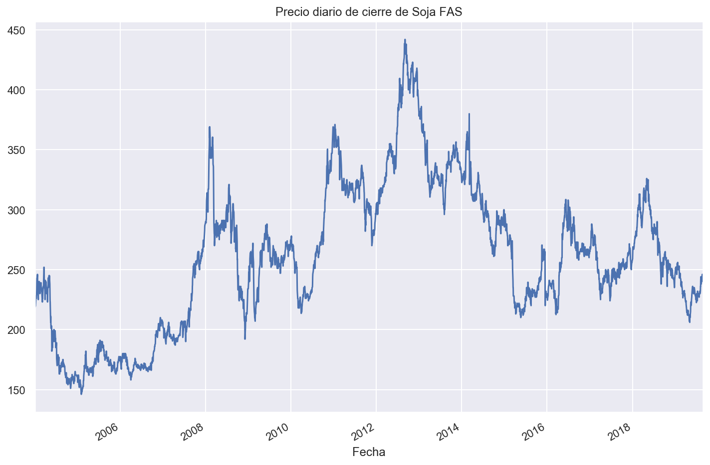

El gráfico sugiere que se trata de una serie no [estacionaria](https://es.wikipedia.org/wiki/Proceso_estacionario), con un *trend* marcado. Podemos confirmar esto con un gáfico de [autocorrelación](https://otexts.com/fpp2/autocorrelation.html). Más aún, con el plot de [autocorrelacion parcial](https://es.wikipedia.org/wiki/Función_de_autocorrelación_parcial), podemos ver que la maxima autocorrelacion esta en el primer lag.

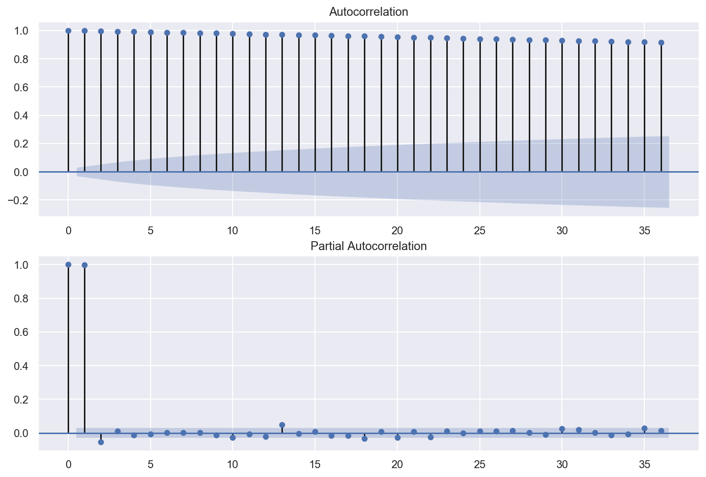

Si la serie fuera estacionaria, uno esperaría que la autocorrelación decreciera rápidamente al aumentar el *lag*, pero esto no es así. Nuestro objetivo, sin embargo, no es predecir el precio de cierre sino el retorno diario, que es (casi) la serie diferenciada. Veamos la autocorrelación de estos retornos.

<label for="imgbiomass-growth" class="margin-toggle">⊕</label>
<input type="checkbox" id="imgbiomass-growth" class="margin-toggle">
Frecuencia de retornos simples diarios.
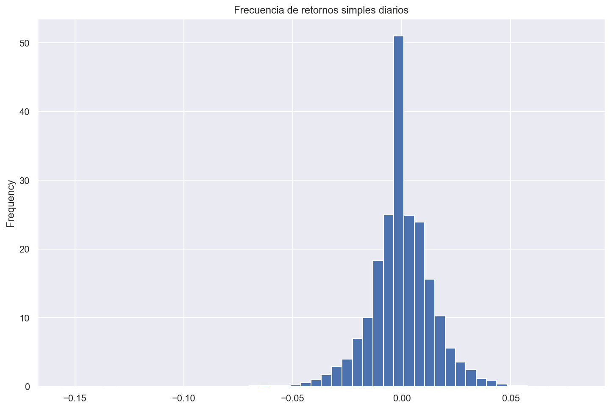

<label for="imgbiomass-growth" class="margin-toggle">⊕</label>
<input type="checkbox" id="imgbiomass-growth" class="margin-toggle">
Retornos diarios.
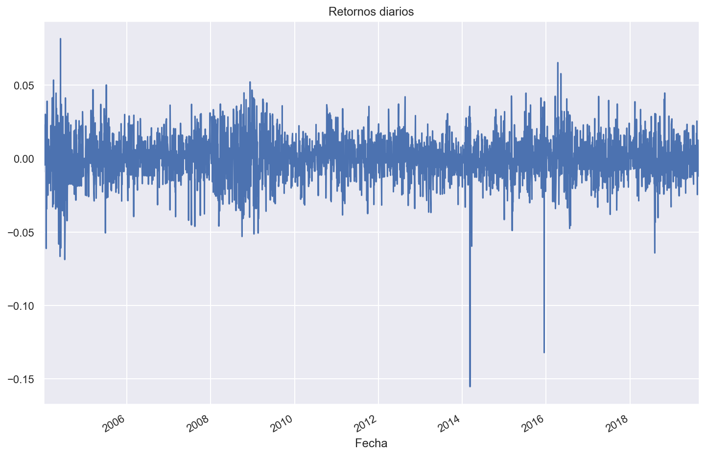

Repetimos los plots de autocorrelación para la serie de retornos diarios.

<label for="imgbiomass-growth" class="margin-toggle">⊕</label>
<input type="checkbox" id="imgbiomass-growth" class="margin-toggle">
Autocorrelación y correlación parcial para retornos diarios.
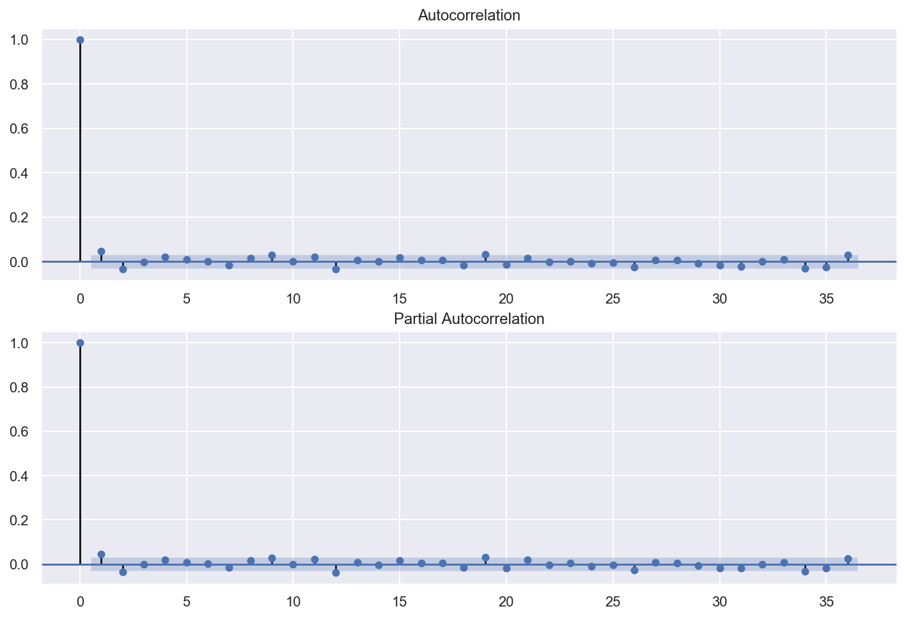

Se ve claramente que al tomar retornos, la autocorrelación baja muy rápido al aumentar el lag, lo que nos dice que estamos en presencia de un proceso más estacionario. 

## Preliminares

Para determinar el grado de estacionaridad de la serie, calculamos el [exponente de Hurst](https://en.wikipedia.org/wiki/Hurst_exponent), una medida que caracteriza el grado de _memoria_ de la serie.  
La idea es considerar la varianza de la serie de lags. Para un lag de orden $\tau$, tenemos:

$${\rm Var}(\tau) = \sum [\log(t+\tau)-\log(t)]^2$$

El exponente de Hurst $H$ queda definido como:

$${\rm Var}(\tau) = \tau^{2H}$$

De acuerdo al valor de dicho exponente, la serie en cuestión es:

- $H < 0.5$ - la serie revierte a la media
- $H = 0.5$ - la serie es un [movimiento browniano geométrico](https://es.wikipedia.org/wiki/Movimiento_browniano)
- $H > 0.5$ - la serie tiene una tendencia

Para una explicación mas detallada, consultar el siguiente [post](https://www.quantstart.com/articles/Basics-of-Statistical-Mean-Reversion-Testing).

Husrt de cierres = 0.51

Hurst de retornos = -0.00084

Vemos que la serie de precios diarios se aproxima a un movimiento browniano, mientras que la serie de retornos presenta una reversión a la media.

## Método ARIMA

Nuestra herramienta principal para la predicción de los retornos será el método ARIMA, que explicamos brevemente a continuación.

[ARIMA](https://en.wikipedia.org/wiki/Autoregressive_integrated_moving_average) (*Autoregressive integrated moving average*) es un modelo aplicado a series de tiempo que considera al valor actual de la serie como una regresión sobre valores previos y al error de regresión como una combinación lineal de errores previos. Más precisamente, si la serie la notamos $\{Y_t\}_{t \in \mathbb{N}}$, el valor a tiempo $t$ se modela por 

$$Y_t = \phi_0 + \sum_{i=1}^{p}{\phi_i Y_{t-i}} + \sum_{i=1}^{q}{\theta_i \varepsilon_{t-i}} + \varepsilon_t$$

donde los $\varepsilon_i$ con $i\neq t$ son errores de regresión, $\varepsilon_t$ es [ruido blanco](https://es.wikipedia.org/wiki/Ruido_blanco) y los coeficientes $\phi_i$ y $\theta_i$ se ajustan típicamente a través de métodos estadísticos. La cantidad de pasos en el pasado que se consideran forma un par de hiperparámetros del modelo (los números $p$ y $q$), con un tercero (generalmente notado $d$) que determina cuántas veces diferenciar la serie antes de aplicarle lo anterior. Todo esto da un método $ARIMA(p,d,q)$. En nuestro caso tomamos $d=0$ porque aplicamos el método a los retornos, que ya son lo suficientemente estacionarios. Si lo quisiéramos aplicar al precio de cierre tomaríamos $d=1$ para diferenciarlo, obteniendo una serie muy similar a los retornos pero a otra escala (porque en cada paso no estaríamos diviendo por el precio del día anterior).

Una vez obtenido el fit por ARIMA, usamos el método GARCH para hacernos una idea de la volatilidad de los residuos y corroborar que ésta es (aproximadamente) constante. 

[GARCH](https://en.wikipedia.org/wiki/Autoregressive_conditional_heteroskedasticity) (*Generalized autoregressive conditional heteroskedasticity*) es otro modelo aplicado a series de tiempo para describir la varianza del error entre el valor observado y el que se había previsto (en nuestro caso, el término $\varepsilon_t$ que se consideraba ruido blanco). Típicamente esta varianza se escribe como combinación lineal de sus valores previos, como en un método ARMA (la $i$ de ARIMA refiere al proceso de diferenciar la serie para volverla estacionaria).

Para decidir qué hiperparámetros de ARIMA tomar usamos el método auto_arima de la librería *pmdarima*, que ajusta el método para diferentes valores de $p$ y $q$, los compara usando el [criterio de información de Akaike](https://es.wikipedia.org/wiki/Criterio_de_informaci%C3%B3n_de_Akaike) y el [criterio de información bayesiano](https://es.wikipedia.org/wiki/Criterio_de_informaci%C3%B3n_bayesiano) y arroja el mejor fit.

<table class="simpletable">
<tr>
     <td></td>        <th>coef</th>     <th>std err</th>      <th>z</th>      <th>P>|z|</th>  <th>[0.025</th>    <th>0.975]</th>  
</tr>
<tr>
  <th>const</th>   <td>    0.0001</td> <td>    0.000</td> <td>    0.525</td> <td> 0.599</td> <td>   -0.000</td> <td>    0.001</td>
</tr>
<tr>
  <th>ar.L1.y</th> <td>   -0.3447</td> <td>    0.191</td> <td>   -1.806</td> <td> 0.071</td> <td>   -0.719</td> <td>    0.029</td>
</tr>
<tr>
  <th>ma.L1.y</th> <td>    0.3950</td> <td>    0.186</td> <td>    2.118</td> <td> 0.034</td> <td>    0.029</td> <td>    0.760</td>
</tr>
</table>
<table class="simpletable">
<caption>Roots</caption>
<tr>
    <td></td>   <th>            Real</th>  <th>         Imaginary</th> <th>         Modulus</th>  <th>        Frequency</th>
</tr>
<tr>
  <th>AR.1</th> <td>          -2.9014</td> <td>          +0.0000j</td> <td>           2.9014</td> <td>           0.5000</td>
</tr>
<tr>
  <th>MA.1</th> <td>          -2.5319</td> <td>          +0.0000j</td> <td>           2.5319</td> <td>           0.5000</td>
</tr>
</table>

Graficamos las predicciones de ARIMA, primero en los retornos y después en el precio de cierre.

<label for="imgbiomass-growth" class="margin-toggle">⊕</label>
<input type="checkbox" id="imgbiomass-growth" class="margin-toggle">
Predicciones ARIMA en los retornos.
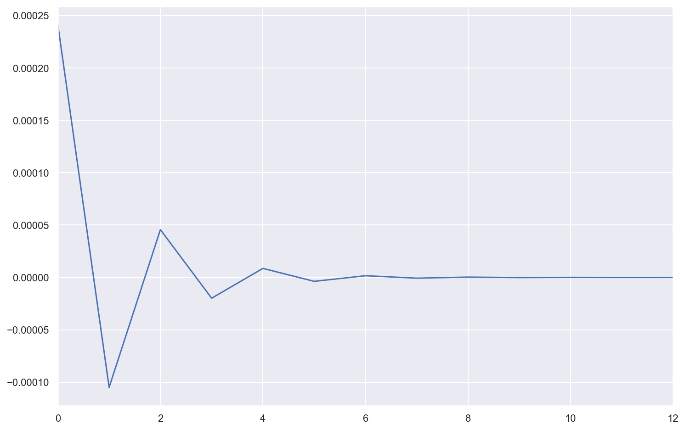

<label for="imgbiomass-growth" class="margin-toggle">⊕</label>
<input type="checkbox" id="imgbiomass-growth" class="margin-toggle">
Predicciones ARIMA en el precio de cierre.
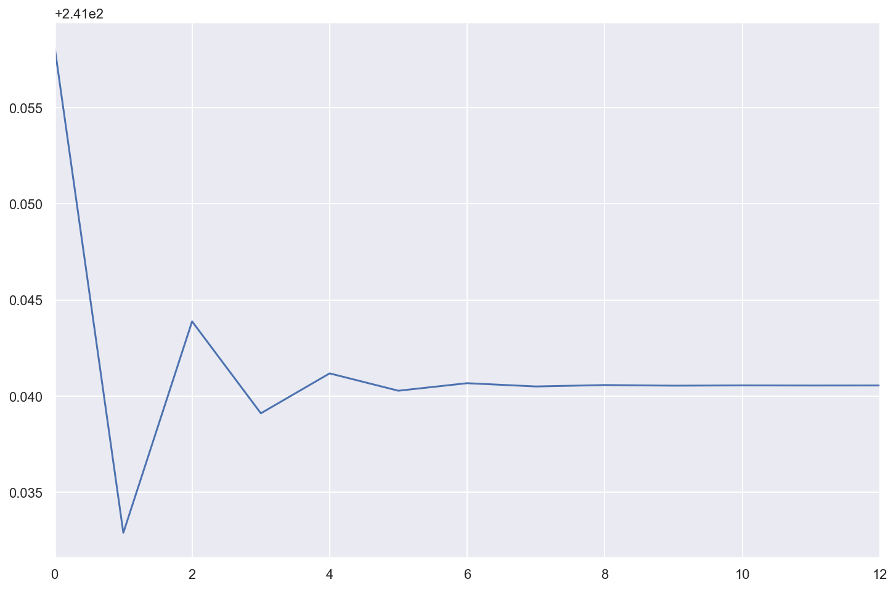

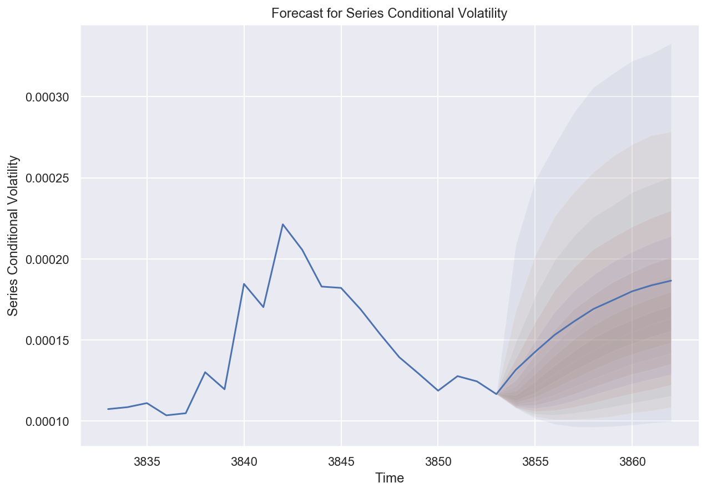

Comparamos ahora las predicciones obtenidas con los valores reales del período 30/08 - 17/09, los 13 días hábiles inmediatamente posteriores a nuestra serie.

Error en los retornos usando ARIMA: 0.00744

Error en los retornos si se predice con el último valor: 0.0074

Error en el precio de cierre usando sólo ARIMA: 1.86

Error en el precio de cierre si se predice con el último valor: 1.85

Al aplicar ARIMA sobre la serie de retornos el resultado es prácticamente cero, lo cual es esperable ya que la idea es que el método capture la [media condicional](https://en.wikipedia.org/wiki/Conditional_expectation) del proceso, y se ve claramente que ésta es (aproximadamente) cero en el gráfico. 

En estas condiciones, la predicción a la que llegamos no es muy diferente a tomar el último valor de precio de cierre. De hecho, si comparamos el error absoluto medio (MAE) de ambas predicciones para las dos semanas posteriores a nuestros datos, la predicción que toma el último valor es un poco más precisa que ARIMA en este caso. Vemos también que GARCH nos da un valor de la volatilidad condicional estable, como buscábamos.

#### Últimos siete meses

Hacemos ahora las mismas predicciones pero restringiendo nuestros datos (la serie de tiempo de retornos) a los últimos siete meses. Esto se corresponde al período febrero-agosto, complementario a la siembra en Argentina (septiembre-enero). 

<label for="imgbiomass-growth" class="margin-toggle">⊕</label>
<input type="checkbox" id="imgbiomass-growth" class="margin-toggle">
Cierre por año, ciclo Febrero-Agosto.
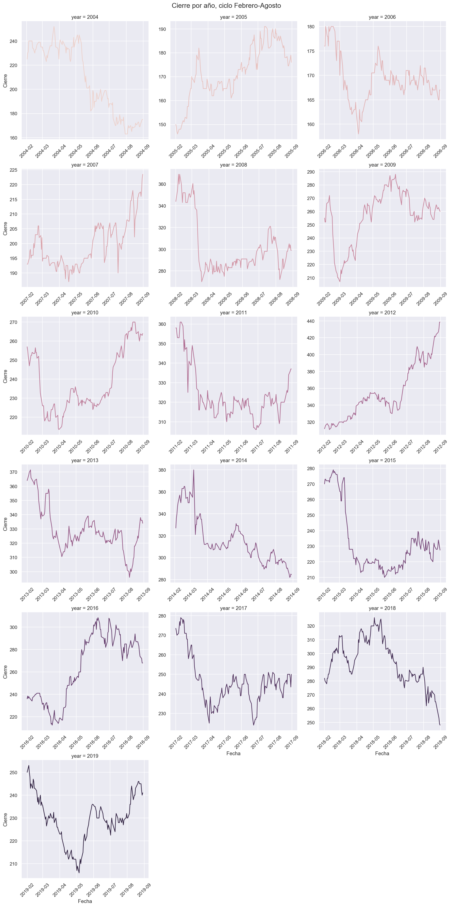

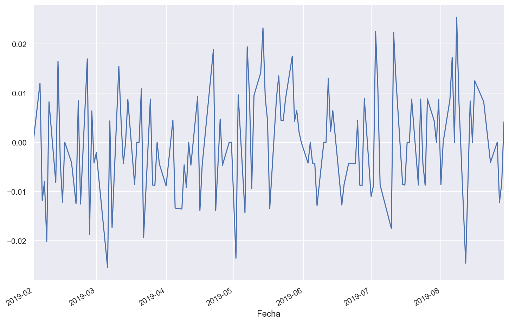

Nuevamente graficamos las predicciones de ARIMA de los retornos y el precio de cierre.

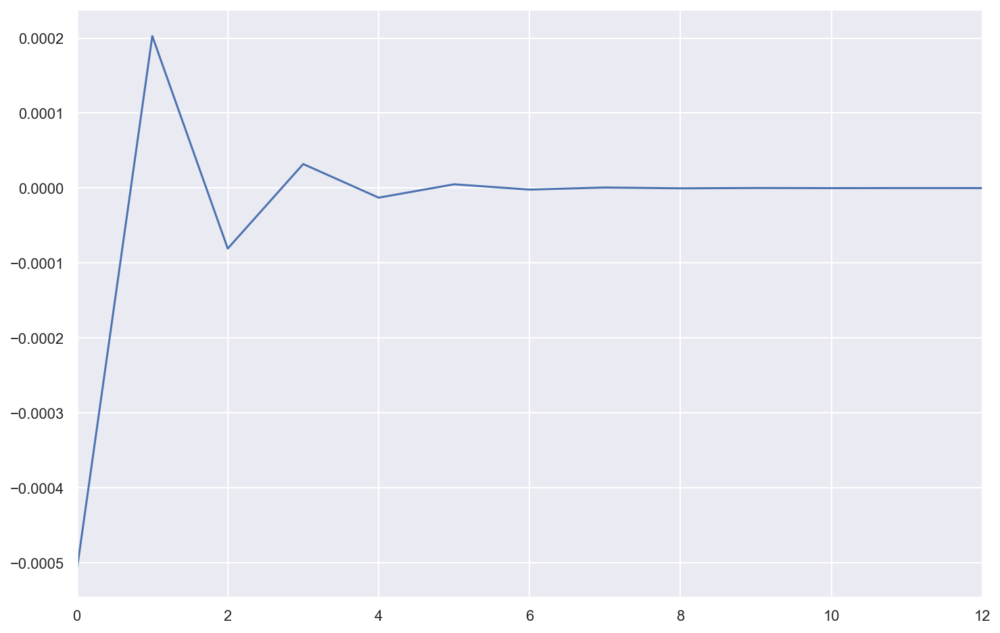

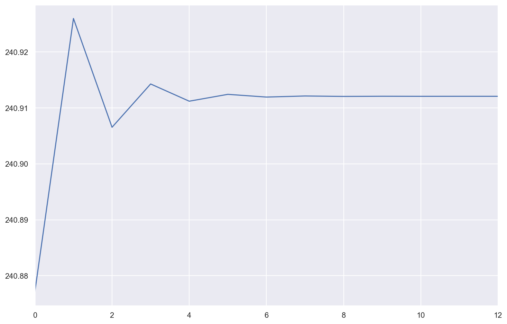

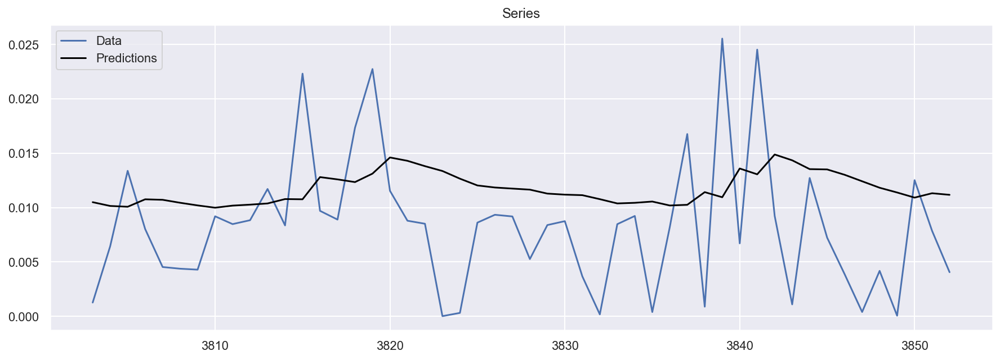

Error en los retornos usando ARIMA
  0.0074

Error en los retornos si se predice con el último valor: 0.0074

Error en el precio de cierre usando ARIMA: 1.824

Error en el precio de cierre si se predice con el último valor: 1.846

### Facebook Prophet

Entre los métodos alternativos que probamos, se encuentra la libreria [Prophet](https://facebook.github.io/prophet/) de Facebook, que implementa un modelo de decomposición aditiva con tres componentes: trend ($g(t)$), estacionalidad ($s(t)$) y feriados (_holidays_, $h(t)$).

$$y(t) = g(t) + s(t) + h(t) + \epsilon_t$$

Siendo $\epsilon_t$ un término de error que no ajusta el modelo. Este modelo es en esencia a un [modelo aditivo generalizado](https://es.wikipedia.org/wiki/Modelo_lineal_generalizado#Modelos_de_aditivos_generalizados) que utiliza el tiempo como regresor.  
Para más información, se puede consultar el [paper original](https://peerj.com/preprints/3190/).

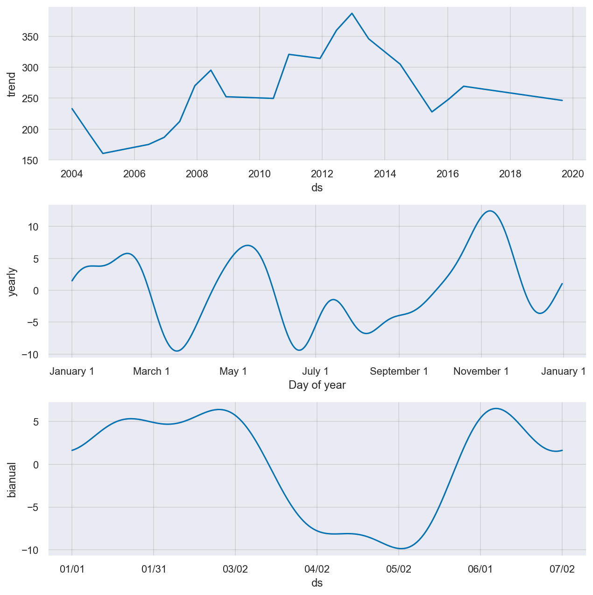

<label for="imgbiomass-growth" class="margin-toggle">⊕</label>
<input type="checkbox" id="imgbiomass-growth" class="margin-toggle">
Cierre de Soja.
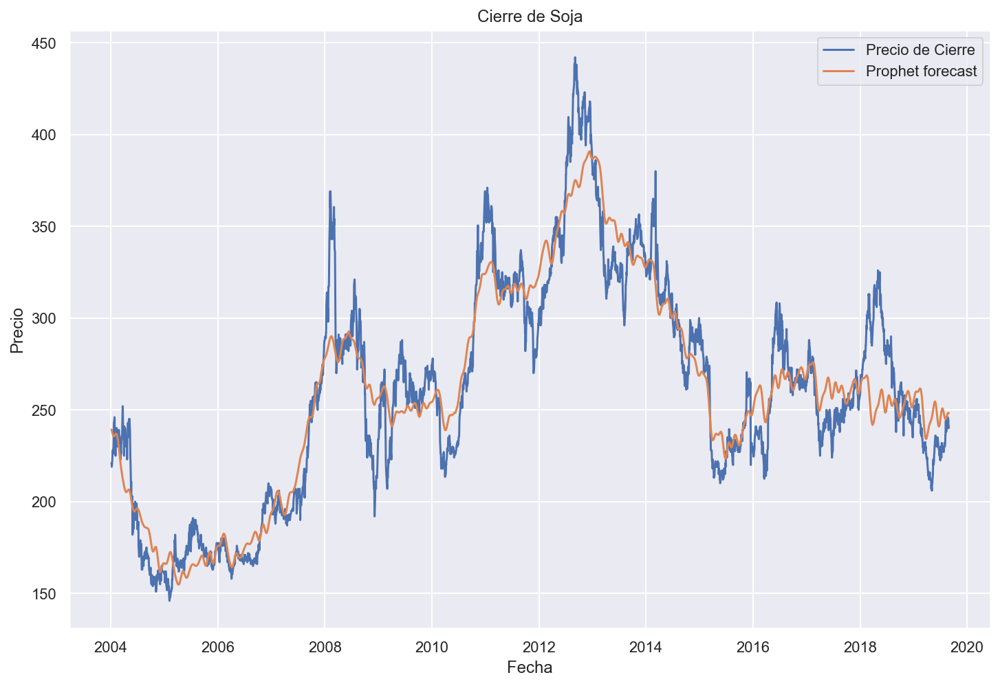

Calculamos a continuación, el [AIC](https://otexts.com/fpp2/selecting-predictors.html) para el forecast de Prophet.

    Prophet AIC = 22965.4

    Prophet forecast MAE = 0.0081

<label for="imgbiomass-growth" class="margin-toggle">⊕</label>
<input type="checkbox" id="imgbiomass-growth" class="margin-toggle">
Cierre de Soja.
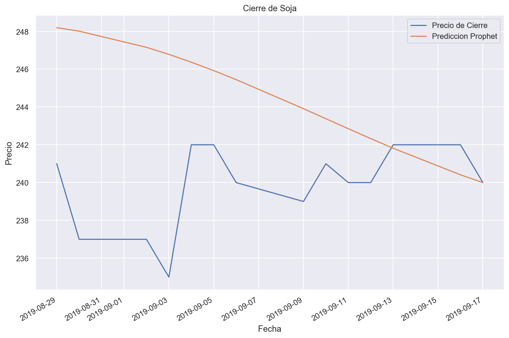

### Autoregresiones Bayesianas

También probamos modelos autoregresivos Bayesianos, donde los coeficientes de los términos de la regresión se aproximan mediante [MCMC](https://en.wikipedia.org/wiki/Markov_chain_Monte_Carlo).  
Hicimos uso del módulo te series temporales de la librería [PyMC3](https://docs.pymc.io/api/distributions/timeseries.html), una potente framework de modelado Bayesiano y programación probabilística.

**AR(1) sobre precio de cierre**

Probamos inicialmente modelando la serie de precios como un proceso $AR(1)$:

$$p_t = \phi_1 p_{t-1} + \epsilon_t$$

Como era esperable según lo visto en los plots de autocorrelación, el modelo asigna un valor cercano a $1$ para el coeficiente del primer término de lag.  
A continuación, hacemos un plot de la predicción del modelo para los próximos 100 días.

<label for="imgbiomass-growth" class="margin-toggle">⊕</label>
<input type="checkbox" id="imgbiomass-growth" class="margin-toggle">
Cierre de la Soja.

**AR(2) sobre precio de cierre**

Probamos ahora un modelo $AR(2)$, sabiendo que la autocorrelación parcial con los lags de mayor orden es cercana a 0.

$$p_t = \phi_1 p_{t-1} + \phi_2 p_{t-2} + \epsilon_t$$

<label for="imgbiomass-growth" class="margin-toggle">⊕</label>
<input type="checkbox" id="imgbiomass-growth" class="margin-toggle">
Cierre de Soja.
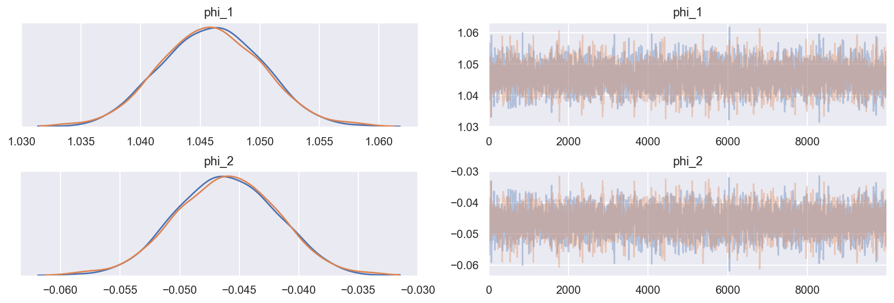

Vemos que el coeficiente del segundo término de lag es cercano a $0$, como era previsible. Veamos el plot de predicciones.

<label for="imgbiomass-growth" class="margin-toggle">⊕</label>
<input type="checkbox" id="imgbiomass-growth" class="margin-toggle">
Cierre de Soja.
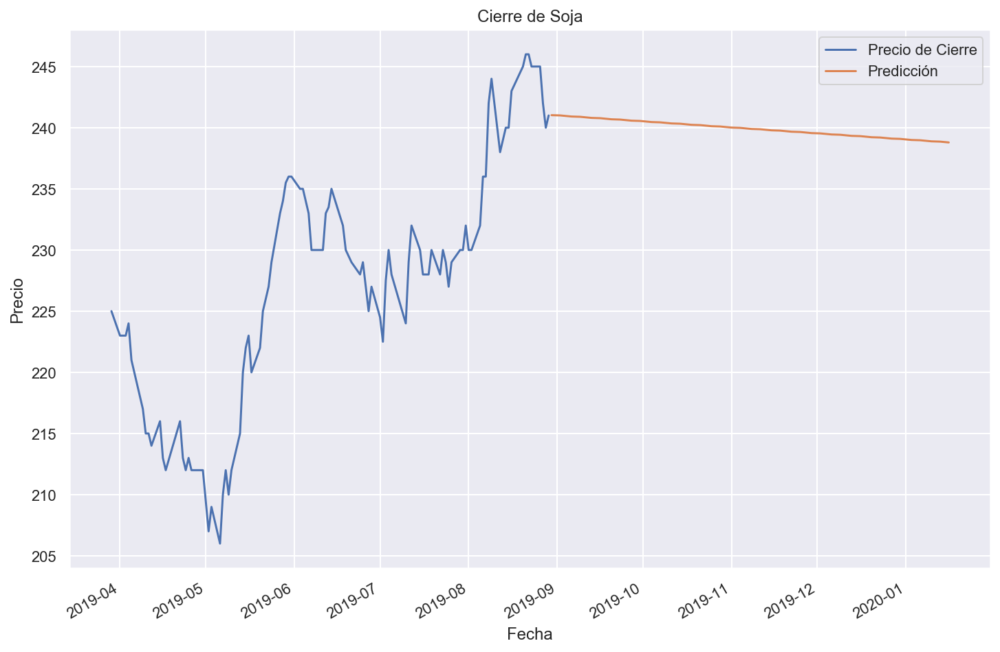

#### _$AR(1)$ sobre retornos_

Probamos a continuación modelando los retornos como un proceso $AR(1)$

$$r_t = \phi_1 r_{t-1} + \epsilon_t$$

<label for="imgbiomass-growth" class="margin-toggle">⊕</label>
<input type="checkbox" id="imgbiomass-growth" class="margin-toggle">
Cierre de Soja.
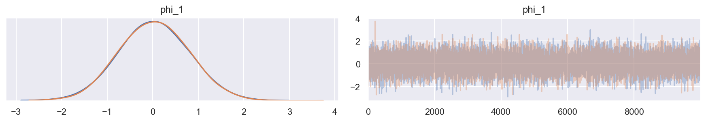

Como era esperable, el coeficiente del primer lag de los retornos es aproximadamente $0$

<label for="imgbiomass-growth" class="margin-toggle">⊕</label>
<input type="checkbox" id="imgbiomass-growth" class="margin-toggle">
Cierre de Soja.

### Bayesian Structural Time Series

Otro enfoque más moderno en el análisis de series temporales es el que desarrolan Scott y Varian en el paper [_Predicting the Present with Bayesian Structural Time Series_](http://people.ischool.berkeley.edu/~hal/Papers/2013/pred-present-with-bsts.pdf) (2014).  
A grandes rasgos, el modelo es un ensamble de predictores: combina la descomposición de series en diferentes variables de estado (tendencia, estacionalidad) con componentes regresivos.

Para la implementación, usamos [Tensorflow Probability](https://www.tensorflow.org/probability/), una librería para programación probabilística creada sobre [Tensorflow](https://www.tensorflow.org).

<label for="imgbiomass-growth" class="margin-toggle">⊕</label>
<input type="checkbox" id="imgbiomass-growth" class="margin-toggle">
Cierre de Soja.
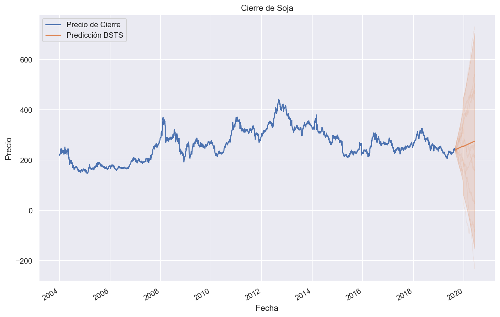

Construimos a continuación un modelo que incorpora estacionalidad mensual y semanal a una tendencia lineal.

Y ploteamos las predicciones con el nuevo modelo.

<label for="imgbiomass-growth" class="margin-toggle">⊕</label>
<input type="checkbox" id="imgbiomass-growth" class="margin-toggle">
Cierre de Soja.
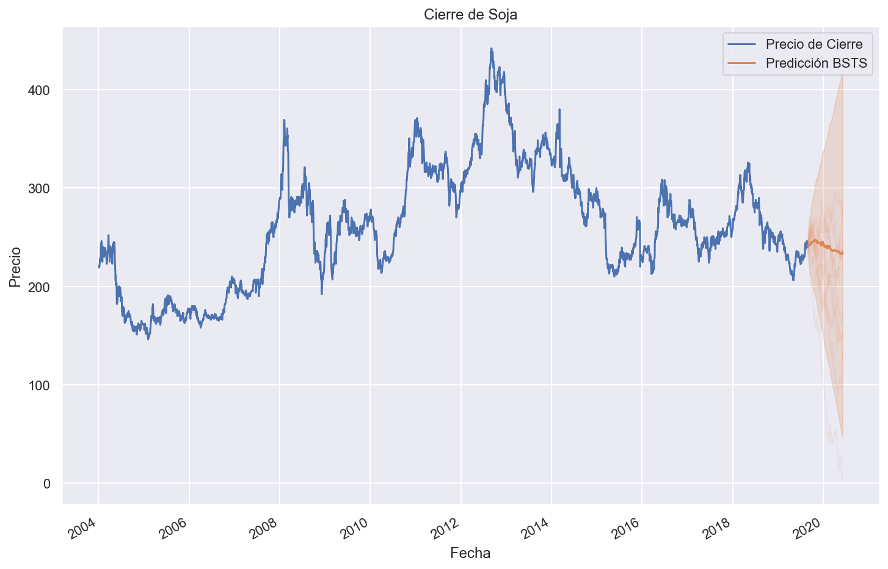

La complejidad de este modelo hace que aquí lo estemos presentando como una [caja negra](https://en.wikipedia.org/wiki/Black_box). Aclarado esto, vemos que las predicciones de este modelo coinciden con los resultados vistos anteriormente: el mejor predictor del precio futuro es el último precio de cierre.

### Modelo final

Predecir el comportamiento de los futuros de commodities ha sido motivo de estudio desde mediados del siglo pasado. En [_Commodity futures and market efficiency_](https://arxiv.org/abs/1309.1492) (2013, Kristoufek, Vosvrda), los autores señalan que los mercados de futuros de commodities (en particular, las relacionadas a la energía) muestran un alto grado de eficiencia, dada la multitud de actores que participan y hacen que el precio refleje toda la información disponible. Esto elimina cualquier tendencia observable en el precio.  
Después de evaluar los distintos modelos observamos que todos coinciden en las predicciones: el mejor predictor del precio de cierrre en el período $t$ es el precio de cierre en el período $t-1$.  
Para nuestra entrada a la competencia,  nos inclinamos por un modelo ARIMA(1,0,1) sobre los retornos diarios. Siendo que este modelo es el mas simple e interpretable de todos los que pudimos evaluar, la [navaja de Ockham](https://es.wikipedia.org/wiki/Navaja_de_Ockham) nos llevo a elegirlo.
